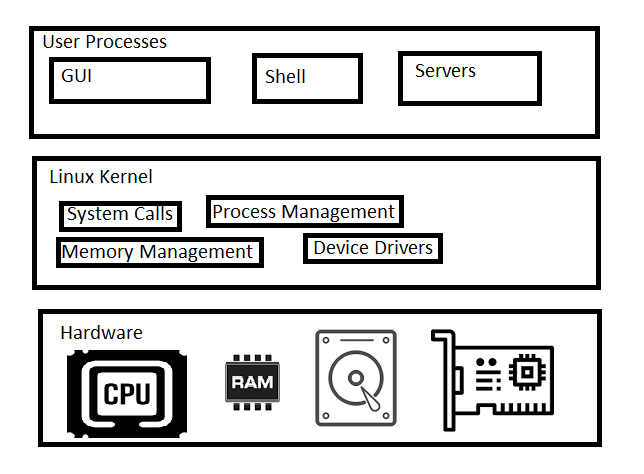

### Linux Foundation Series

### Linux - The Operating System
* RedHat Linux, Ubuntu, Centos, SUSE etc are called as distributions.
* Distribution is Linux + software suite of applications, developer tools
* In this essesce Linux is core of the operting system : _kernel_

### Layers of abstraction in Linux
* General Linux System Organization

